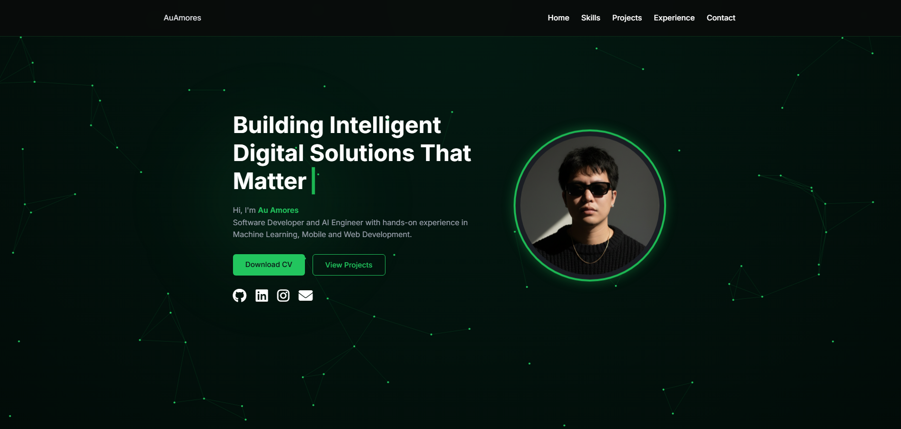
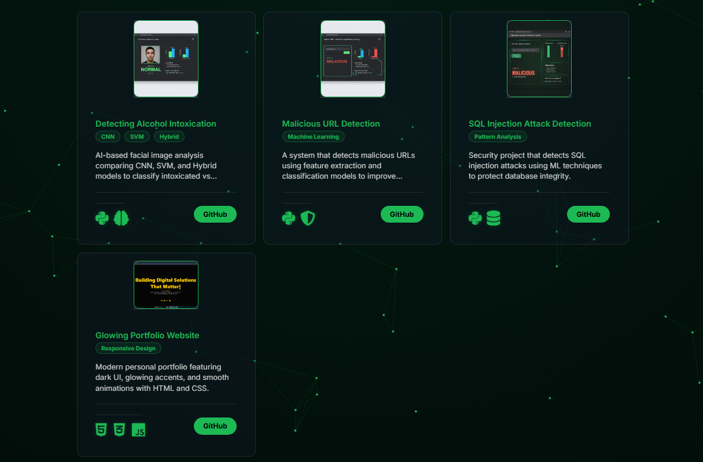
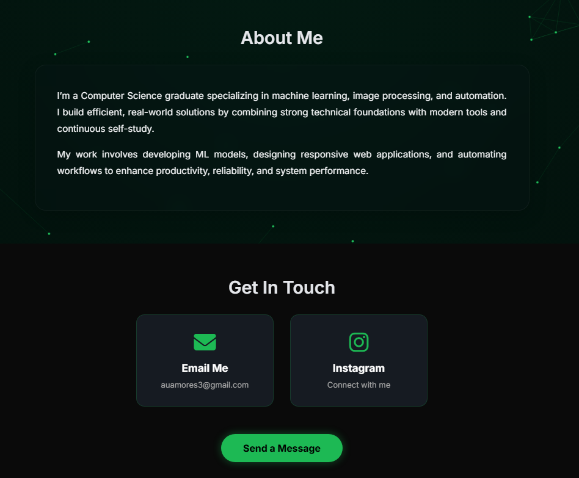

# 🌐 AuAmores Portfolio

Personal portfolio website showcasing my projects, skills, and experience in **software development, AI, and automation**.

🔗 **Live Demo:** https://auamores-portfolio.vercel.app/

---

## ✨ Features

- Modern, responsive UI
- Typing text animation
- Animated background effects
- Downloadable CV
- Project showcase section
- Deployed on Vercel

---

## 🛠️ Built With

- **HTML5**
- **CSS3**
- **JavaScript (Vanilla)**
- **Vercel** – deployment & hosting

---

## 📂 Project Structure
auamores-portfolio/
│
├── assets/ # Images, icons, and media
├── index.html # Main HTML file
├── style.css # Styling
├── typing.js # Typing animation logic
├── background.js # Animated background effects
├── README.md # Project documentation
└── LICENSE # MIT License

👤 Author

Yu (AuAmores)
Aspiring Software Developer | AI & Automation Enthusiast

GitHub: https://github.com/ares-coding

Portfolio: https://auamores-portfolio.vercel.app/

## 📸 Screenshots

### 🏠 Home

### 🧠 Projects

### 👤 About

📄 License

This project is licensed under the MIT License.
Feel free to use, modify, and distribute.
